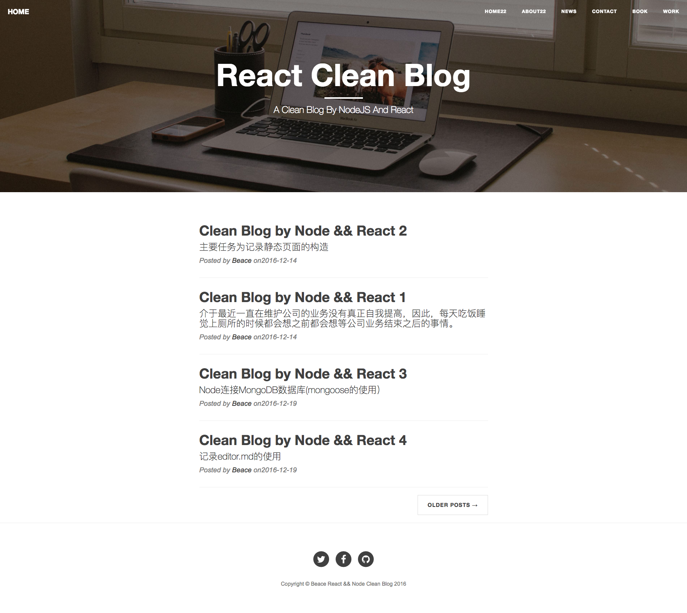

# expressjs-react-blog

node(expressjs) and react blog

## Look Like



## Visit

[index page](https://beace.tech/)

## how to run it ?

### mongoDB

DB: article
Collection: articles

### CLI

```bash
git clone https://github.com/BeAce/expressjs-react-blog.git
cd expressjs-react-blog
npm install
npm start && npm run be-start
```

run js/babel
```bash
npm run webpack
```
